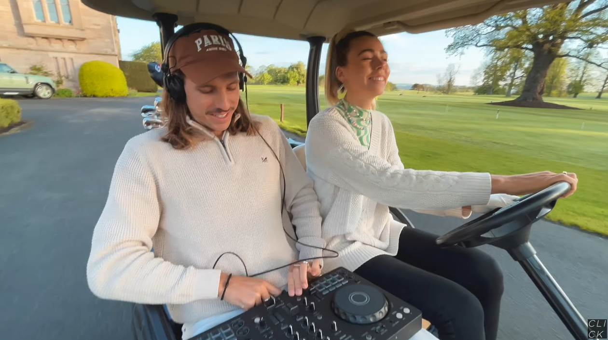

&nbsp;

## *PIXEL CRAFT*
   

# Навигация
 - [Настройка готового проекта](#setting_up_a_project)
 - [Полезные команды](#useful_commands)
 - [Требования к проекту](#project_requirements)
 - [Музычка для разработки](#nekos_music)
   

 
## Настройка готового проекта
 - Версия Python: 3.11
 - После скачивания проекта к себе на компьютер не забудьте установить необходимые зависимости, прописав к консоли команду:  `pip install -r requirements.txt`
   

 
## Полезные команды
 - Сохранить список зависимостей в файл requirements.txt: `pip freeze > requirements.txt`
 - Отобразить зависимости в консоль: `pip list`
 - Удалить файл из контроля версий: `git rm --cache [путь до файла]`
 - Удалить все зависимости: `pip uninstall -y -r requirements.txt`
 - Установить зависимости: `pip install -r requirements.txt`
   

 
# Требования к проекту
- Игра должна быть написана на PyGame

Технические - 45:
1) Соответствие разобранным принципам программирования (за весь первый курс, включая то, что было на парах): SOLID, DRY, KISS, и другим, ООП/ФП: 10 баллов
2) Сложность алгоритмов: 15 баллов

    Алгоритма нет: 0%.

    Легкие алгоритмы. Примеры: алгоритм давался на парах, AABB: 20%

    Средние алгоритмы. Примеры: оптимизация алгоритма с пар (улучшенный BFS/DFS, A* и т.д.): 40%

    Все, что сложнее и комплекснее (QuadTree, дерево решений, Perlin noise и т.д.): 60+%

    Надо понимать, что выполнив 2 алгоритма с пар вы не получите 40*2%, но немного доп.баллов при хорошей реализации и защите получите.

    Примеры дают ориентировочный уровень сложности алгоритма.

    Все остальное зависит от сложности алгоритма, его реализации, вашего понимания.

3) Корректная, обоснованная реализация архитектуры проекта: MV*/ECS/EC/альтернативы: 15 баллов.
4) Полноценность проекта: работоспособность, удобство, производительность, целостность (внешняя и внутренняя) и прочее: 5 баллов
Нетехнические - 5:

1) Красивости и прочее креативное: 5 баллов

- Безосновательное использование библиотек/списывание и т.д. - минус баллы. Пример безосновательного использования библиотек: ничего/почти ничего не реализовано в проекте самостоятельно, все на основе библиотек.
   

## Музычка для разработки [Neko's edition]

  

    <a href='https://www.youtube.com/watch?v=k91a5HNwoAw'>Golf car house mix</a>
  

  </img>

  

    <a href='https://www.youtube.com/watch?v=vgd-95t-jR4'>Bali vibes melodic house mix</a>
  

  </img>

  

    <a href='https://www.youtube.com/watch?v=xaFIBS3V9s4'>Melodic techno cliffside mix</a>
  

  </img>

   
