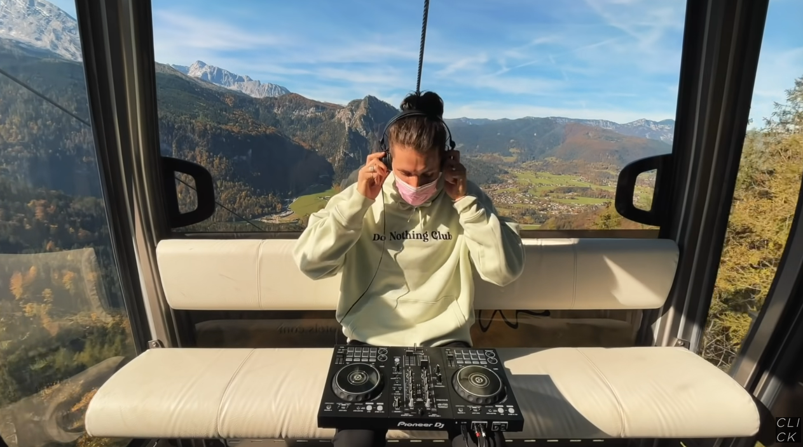
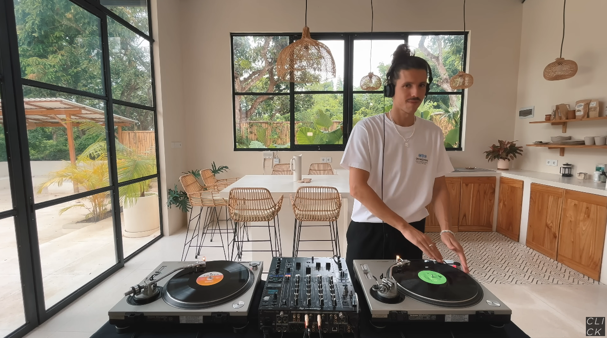
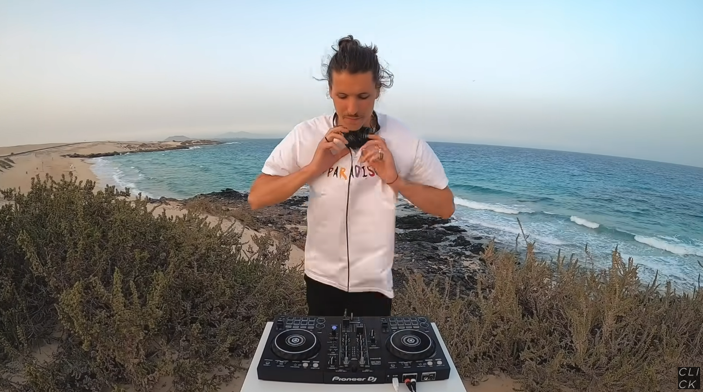

&nbsp;

## *WASTE LANDS*
Идея игры: "Заброшенные земли"

Описание игры: 

Игрок оказывается в открытом мире, наполненном таинственными событиями и ужасами. Цель игры - исследовать просторы местности, раскрывать тайны и побеждать ужасы, что поджидают в каждом уголке

Функционал:

1. Геймплей:

Игрок будет свободно исследовать различные локации на открытой местности, такие как леса, поля, горы и болота.
На пути игрока будут встречаться различные ужасы и опасности, от преследующих монстров до аномальных явлений.
Цель игры - раскрыть тайны местности и найти способы защиты или выживания

2. Управление:

Игрок будет управлять персонажем с помощью клавиатуры или геймпада, перемещая его по открытой местности и взаимодействуя с объектами

3. Алгоритмы:

Легкий алгоритм: 

Реализация алгоритма перемещения персонажа по местности и взаимодействия с объектами

Средний алгоритм: 

Реализация алгоритма управления поведением ужасных существ или явлений (например, случайное появление или преследование игрока)

4. Архитектура проекта:

Использование архитектурного паттерна MVC (Model-View-Controller) для разделения логики игры, ее отображения и управления пользовательским интерфейсом.
Реализация модели для хранения данных о состоянии персонажа, объектов местности и текущих заданиях.
Использование ViewModel для управления взаимодействием между моделью и представлением (визуализацией на экране) и обработки пользовательских действий

5. Креативность:

Разнообразие местности с уникальной атмосферой и характеристиками, каждая из которых скрывает свои тайны и опасности.
Различные виды ужасов и монстров, каждый со своими особенностями и способностями.
Возможность влиять на окружающий мир и развивать персонажа, чтобы противостоять всем ужасам и выжить
   

# Навигация
 - [Настройка готового проекта](#setting_up_a_project)
 - [Полезные команды](#useful_commands)
 - [Полезные ссылки](#useful_urls)
 - [Структура проекта](#project_structure)
 - [Требования к проекту](#project_requirements)
 - [Музычка для разработки](#nekos_music)
   

 
## Настройка готового проекта
 - Версия Python: 3.11.8
 - После скачивания проекта к себе на компьютер не забудьте установить необходимые зависимости, прописав к консоли команду:  `pip install -r requirements.txt`
   

 
## Полезные команды
 - Сохранить список зависимостей в файл requirements.txt: `pip freeze > requirements.txt`
 - Отобразить зависимости в консоль: `pip list`
 - Удалить файл из контроля версий: `git rm --cache [путь до файла]`
 - Удалить все зависимости: `pip uninstall -y -r requirements.txt`
 - Установить зависимости: `pip install -r requirements.txt`
   

 
## Полезные ссылки
[Звуки игры, звуковые эффекты](https://pixabay.com/ru/sound-effects/search/%d0%b7%d0%b2%d1%83%d0%ba%d0%b8%20%d0%b8%d0%b3%d1%80%d1%8b/?pagi=9)
   

# Структура проекта
    Waste_lands
    |__mvc
    | |__model
    | | |__enemy.py
    | | |__inventory.py
    | | |__items.py
    | | |__player.py
    | | |__world.py
    | |
    | |__view
    | | |__menu.py
    | |
    | |__controller
    |   |__perling_noise.py
    |   |__utils.py
    |
    |__sounds
    |__sprites
    |__tests
    |
    |__config.py
    |__main.py
    |__settings.py
    |
    |__README.md
    |__requirements.txt
   

 
# Требования к проекту
- Игра должна быть написана на PyGame

Технические - 45:
1) Соответствие разобранным принципам программирования (за весь первый курс, включая то, что было на парах): SOLID, DRY, KISS, и другим, ООП/ФП: 10 баллов
2) Сложность алгоритмов: 15 баллов

    Алгоритма нет: 0%.

    [✓] Легкие алгоритмы. Примеры: алгоритм давался на парах, AABB (Axis-Aligned Bounding Box): 20%

    [ ] Средние алгоритмы. Примеры: оптимизация алгоритма с пар (улучшенный BFS/DFS, A* и т.д.): 40%

    [ ] Все, что сложнее и комплекснее (QuadTree, дерево решений, Perlin noise и т.д.): 60+%

    Надо понимать, что выполнив 2 алгоритма с пар вы не получите 40*2%, но немного доп.баллов при хорошей реализации и защите получите.

    Примеры дают ориентировочный уровень сложности алгоритма.

    Все остальное зависит от сложности алгоритма, его реализации, вашего понимания.

3) Корректная, обоснованная реализация архитектуры проекта: MV*/ECS/EC/альтернативы: 15 баллов.
4) Полноценность проекта: работоспособность, удобство, производительность, целостность (внешняя и внутренняя) и прочее: 5 баллов
Нетехнические - 5:

1) Красивости и прочее креативное: 5 баллов

- Безосновательное использование библиотек/списывание и т.д. - минус баллы. Пример безосновательного использования библиотек: ничего/почти ничего не реализовано в проекте самостоятельно, все на основе библиотек.
   

## Музычка для разработки [Neko's edition]

  

    <a href='https://www.youtube.com/watch?v=sD-FEPismf4'>Deep house sunrise mix under palm trees</a>
  

  </img>

  

    <a href='https://www.youtube.com/watch?v=ZpK0UqP7T-g'>Calming house mix</a>
  

  </img>

  

    <a href='https://www.youtube.com/watch?v=G-ZtNK8IVAU'>Beach house mix</a>
  

  </img>

  

    <a href='https://www.youtube.com/watch?v=c_hO_fjmMnk'>Desert vibes melodic house mix</a>
  

  </img>

  

    <a href='https://www.youtube.com/watch?v=tyZqw_UuiF0'>Gondola house mix</a>
  

  </img>

  

    <a href='https://www.youtube.com/watch?v=dSZRLMcml8k'>Wavey vinyl house mix</a>
  

  </img>

  

    <a href='https://www.youtube.com/watch?v=ujLBD9pFPtY'>Melodic house beachy sundowner mix</a>
  

  </img>

  

    <a href='https://www.youtube.com/watch?v=ujLBD9pFPtY'>Deep house sunrise mix</a>
  

  </img>

  

    <a href='https://www.youtube.com/watch?v=k91a5HNwoAw'>Golf car house mix</a>
  

  </img>

  

    <a href='https://www.youtube.com/watch?v=vgd-95t-jR4'>Bali vibes melodic house mix</a>
  

  </img>

  

    <a href='https://www.youtube.com/watch?v=xaFIBS3V9s4'>Melodic techno cliffside mix</a>
  

  </img>

   
